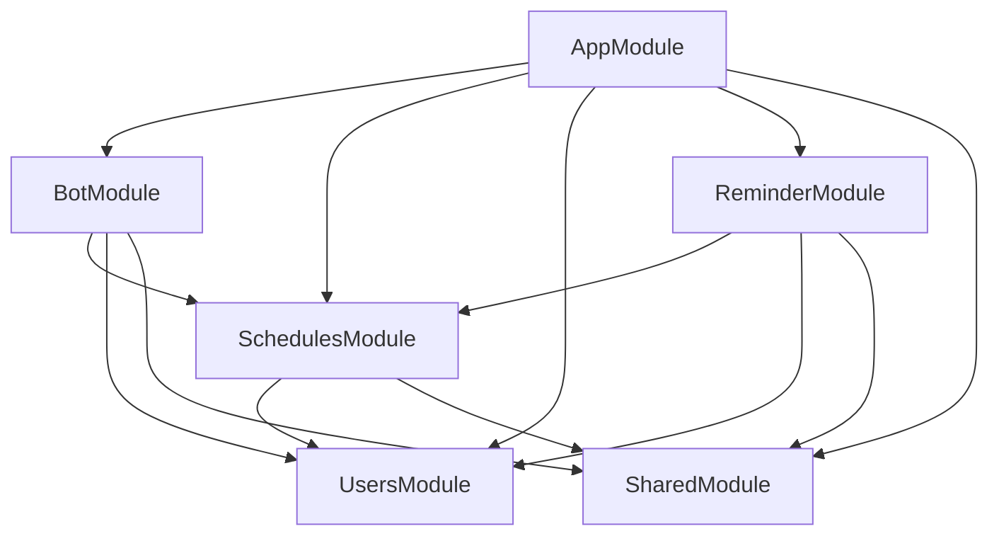

# 💻 Development Guide

Hướng dẫn phát triển và maintain Hệ Thống Chatbot Quản Lý Sự Kiện & Nhắc Việc Trên Mezon cho developers.

## 🏗️ Kiến Trúc Code

### Cấu Trúc Thư Mục

```
src/
├── main.ts                          # Bootstrap ứng dụng
├── app.module.ts                    # Root module
├── config/                          # Configuration files
│   └── database.config.ts
├── bot/                             # Bot core logic
│   ├── bot.service.ts               # MezonClient wrapper
│   ├── bot.gateway.ts               # Event listeners
│   ├── bot.module.ts                # Bot module
│   ├── commands/                    # Command handlers
│   │   ├── command-catalog.ts       # Command definitions
│   │   ├── command-registry.ts      # Command registration
│   │   ├── command-router.ts        # Command routing
│   │   ├── command.types.ts         # Type definitions
│   │   └── *.command.ts             # Individual commands
│   └── interactions/                # Button/form interactions
│       ├── interaction-registry.ts
│       ├── interaction-router.ts
│       └── interaction.types.ts
├── schedules/                       # Schedule management
│   ├── entities/                    # TypeORM entities
│   ├── schedules.service.ts         # Main service
│   ├── tags.service.ts              # Tag management
│   ├── shares.service.ts            # Schedule sharing
│   ├── audit.service.ts             # Audit logging
│   └── undo.service.ts              # Undo operations
├── users/                           # User management
│   ├── entities/
│   ├── users.service.ts
│   └── users.module.ts
├── reminder/                        # Reminder system
│   ├── reminder.service.ts          # Cron jobs
│   ├── reminder-interaction.handler.ts
│   └── reminder.module.ts
└── shared/                          # Shared utilities
    └── utils/
        ├── date-parser.ts           # Date parsing logic
        ├── date-utils.ts            # Date utilities
        ├── message-formatter.ts     # Message formatting
        ├── priority.ts              # Priority utilities
        ├── recurrence.ts            # Recurrence logic
        └── working-hours.ts         # Working hours logic
```

### Module Dependencies



## 🔧 Development Workflow

### 1. Setup Development Environment

```bash
# Clone và setup
git clone <repo>
cd BotThoiGianBieu
npm install
cp .env.example .env

# Chỉnh .env với development values
# Chạy migrations
# Start development server
npm run start:dev
```

### 2. Code Style & Standards

#### ESLint & Prettier

```bash
# Lint code
npm run lint

# Format code
npm run format

# Lint và fix
npm run lint -- --fix
```

#### TypeScript Strict Mode

Project sử dụng TypeScript strict mode:

```json
// tsconfig.json
{
  "compilerOptions": {
    "strict": true,
    "noImplicitAny": true,
    "strictNullChecks": true,
    "strictFunctionTypes": true
  }
}
```

#### Naming Conventions

- **Files**: kebab-case (`user-settings.entity.ts`)
- **Classes**: PascalCase (`UserSettingsEntity`)
- **Methods/Variables**: camelCase (`getUserSettings`)
- **Constants**: UPPER_SNAKE_CASE (`DEFAULT_REMIND_MINUTES`)
- **Interfaces**: PascalCase với prefix I (`ICommandContext`)

### 3. Git Workflow

#### Branch Strategy

```
main                    # Production-ready code
├── develop            # Integration branch
├── feature/xxx        # Feature branches
├── bugfix/xxx         # Bug fix branches
└── hotfix/xxx         # Emergency fixes
```

#### Commit Convention

Sử dụng Conventional Commits:

```
type(scope): description

feat(commands): add lich-thang command
fix(reminder): fix timezone calculation bug
docs(api): update command reference
test(schedules): add recurrence tests
refactor(bot): extract message formatting
```

**Types:**
- `feat`: New feature
- `fix`: Bug fix
- `docs`: Documentation
- `test`: Tests
- `refactor`: Code refactoring
- `perf`: Performance improvement
- `chore`: Maintenance tasks

#### Pull Request Process

1. **Create feature branch**
   ```bash
   git checkout -b feature/new-command
   ```

2. **Develop & test**
   ```bash
   npm test
   npm run lint
   npm run build
   ```

3. **Commit changes**
   ```bash
   git add .
   git commit -m "feat(commands): add new command"
   ```

4. **Push & create PR**
   ```bash
   git push origin feature/new-command
   # Create PR on GitHub
   ```

5. **Code review & merge**

## 🆕 Thêm Command Mới

### 1. Tạo Command File

```typescript
// src/bot/commands/example.command.ts
import { Injectable, OnModuleInit } from '@nestjs/common';
import { BotCommand, CommandContext } from './command.types';
import { CommandRegistry } from './command-registry';

@Injectable()
export class ExampleCommand implements BotCommand, OnModuleInit {
  readonly name = 'example';
  readonly aliases = ['ex', 'demo'];
  readonly description = 'Example command';
  readonly category = '✏️ QUẢN LÝ LỊCH';
  readonly syntax = 'example <param>';

  constructor(
    private readonly commandRegistry: CommandRegistry,
    // Inject services cần thiết
  ) {}

  onModuleInit(): void {
    this.commandRegistry.register(this);
  }

  async execute(ctx: CommandContext): Promise<void> {
    // Validate user exists
    const user = await this.usersService.findByUserId(ctx.message.sender_id);
    if (!user) {
      await ctx.reply('⚠️ Bạn chưa khởi tạo tài khoản. Dùng `*bat-dau` trước.');
      return;
    }

    // Parse arguments
    const args = ctx.args;
    if (args.length === 0) {
      await ctx.reply('❌ Thiếu tham số. Cú pháp: `*example <param>`');
      return;
    }

    // Business logic
    try {
      const result = await this.doSomething(args[0]);
      await ctx.reply(`✅ Thành công: ${result}`);
    } catch (error) {
      await ctx.reply(`❌ Lỗi: ${error.message}`);
    }
  }

  private async doSomething(param: string): Promise<string> {
    // Implementation
    return `Processed: ${param}`;
  }
}
```

### 2. Đăng Ký Command

```typescript
// src/bot/bot.module.ts
@Module({
  providers: [
    // ... existing commands
    ExampleCommand,
  ],
})
export class BotModule {}
```

### 3. Thêm Vào Catalog

```typescript
// src/bot/commands/command-catalog.ts
export const COMMAND_CATALOG: CatalogEntry[] = [
  // ... existing entries
  {
    name: "example",
    syntax: "example <param>",
    description: "Example command description",
    category: "✏️ QUẢN LÝ LỊCH",
  },
];
```

### 4. Viết Tests

```typescript
// test/bot/example.command.spec.ts
import { Test } from '@nestjs/testing';
import { ExampleCommand } from '../../src/bot/commands/example.command';

describe('ExampleCommand', () => {
  let command: ExampleCommand;

  beforeEach(async () => {
    const module = await Test.createTestingModule({
      providers: [ExampleCommand, /* mock dependencies */],
    }).compile();

    command = module.get<ExampleCommand>(ExampleCommand);
  });

  it('should be defined', () => {
    expect(command).toBeDefined();
  });

  it('should execute successfully', async () => {
    // Test implementation
  });
});
```

## 🔄 Thêm Interactive Features

### 1. Form Interactions

```typescript
// Trong command execute method
const embed = new InteractiveBuilder('Form Title')
  .setDescription('Form description')
  .addInputField('field1', 'Label', 'Placeholder', {}, 'Help text')
  .addSelectField('field2', 'Select Label', options, defaultValue)
  .build();

const buttons = new ButtonBuilder()
  .addButton('interaction_id:confirm', '✅ Confirm', EButtonMessageStyle.SUCCESS)
  .addButton('interaction_id:cancel', '❌ Cancel', EButtonMessageStyle.DANGER)
  .build();

await this.botService.sendInteractive(ctx.message.channel_id, embed, buttons);
```

### 2. Button Handlers

```typescript
// Implement InteractionHandler interface
export class ExampleCommand implements BotCommand, InteractionHandler {
  readonly interactionId = 'example';

  async handleButton(ctx: ButtonInteractionContext): Promise<void> {
    const { action, formData, clickerId } = ctx;

    if (action === 'cancel') {
      await ctx.deleteForm();
      await ctx.send('❌ Đã hủy');
      return;
    }

    if (action === 'confirm') {
      // Process form data
      const field1 = formData.field1?.trim();
      // ... validation and processing
      
      await ctx.deleteForm();
      await ctx.send('✅ Thành công');
    }
  }
}
```

### 3. Đăng Ký Interaction

```typescript
// Trong onModuleInit
onModuleInit(): void {
  this.commandRegistry.register(this);
  this.interactionRegistry.register(this); // Thêm dòng này
}
```

## 🗄️ Database Operations

### 1. Tạo Entity Mới

```typescript
// src/schedules/entities/new-entity.entity.ts
import { Entity, PrimaryGeneratedColumn, Column, CreateDateColumn } from 'typeorm';

@Entity('new_entities')
export class NewEntity {
  @PrimaryGeneratedColumn()
  id!: number;

  @Column({ type: 'varchar', length: 255 })
  name!: string;

  @Column({ type: 'text', nullable: true })
  description!: string | null;

  @CreateDateColumn({ type: 'timestamp with time zone' })
  created_at!: Date;
}
```

### 2. Tạo Migration

```sql
-- migrations/014-add-new-entity.sql
-- Migration: Add new_entities table
-- Created: 2026-04-27

-- Create table if not exists (idempotent)
CREATE TABLE IF NOT EXISTS new_entities (
    id SERIAL PRIMARY KEY,
    name VARCHAR(255) NOT NULL,
    description TEXT,
    created_at TIMESTAMP WITH TIME ZONE DEFAULT NOW()
);

-- Add indexes
CREATE INDEX IF NOT EXISTS idx_new_entities_name ON new_entities(name);

-- Add constraints if needed
-- ALTER TABLE new_entities ADD CONSTRAINT unique_name UNIQUE (name);
```

### 3. Service Operations

```typescript
// src/schedules/new-entity.service.ts
@Injectable()
export class NewEntityService {
  constructor(
    @InjectRepository(NewEntity)
    private readonly repository: Repository<NewEntity>,
  ) {}

  async create(data: Partial<NewEntity>): Promise<NewEntity> {
    const entity = this.repository.create(data);
    return this.repository.save(entity);
  }

  async findByUserId(userId: string): Promise<NewEntity[]> {
    return this.repository.find({
      where: { user_id: userId },
      order: { created_at: 'DESC' },
    });
  }

  async update(id: number, data: Partial<NewEntity>): Promise<void> {
    await this.repository.update(id, data);
  }

  async delete(id: number): Promise<void> {
    await this.repository.delete(id);
  }
}
```

## 🔔 Cron Jobs & Background Tasks

### 1. Tạo Cron Service

```typescript
// src/background/new-cron.service.ts
import { Injectable } from '@nestjs/common';
import { Cron, CronExpression } from '@nestjs/schedule';

@Injectable()
export class NewCronService {
  private readonly logger = new Logger(NewCronService.name);

  @Cron(CronExpression.EVERY_MINUTE)
  async handleCron(): Promise<void> {
    this.logger.debug('Running cron job...');
    
    try {
      // Cron logic here
      const results = await this.processItems();
      this.logger.log(`Processed ${results.length} items`);
    } catch (error) {
      this.logger.error('Cron job failed', error.stack);
    }
  }

  private async processItems(): Promise<any[]> {
    // Implementation
    return [];
  }
}
```

### 2. Đăng Ký Cron Service

```typescript
// src/background/background.module.ts
@Module({
  providers: [NewCronService],
})
export class BackgroundModule {}

// src/app.module.ts
@Module({
  imports: [
    ScheduleModule.forRoot(), // Bật cron jobs
    BackgroundModule,
  ],
})
export class AppModule {}
```

## 🧪 Testing Strategy

### 1. Unit Tests

```typescript
// test/schedules/schedules.service.spec.ts
describe('SchedulesService', () => {
  let service: SchedulesService;
  let repository: Repository<Schedule>;

  beforeEach(async () => {
    const module = await Test.createTestingModule({
      providers: [
        SchedulesService,
        {
          provide: getRepositoryToken(Schedule),
          useValue: {
            create: jest.fn(),
            save: jest.fn(),
            find: jest.fn(),
            findOne: jest.fn(),
            update: jest.fn(),
            delete: jest.fn(),
          },
        },
      ],
    }).compile();

    service = module.get<SchedulesService>(SchedulesService);
    repository = module.get<Repository<Schedule>>(getRepositoryToken(Schedule));
  });

  it('should create schedule', async () => {
    const scheduleData = {
      user_id: 'user123',
      title: 'Test Schedule',
      start_time: new Date(),
    };

    const savedSchedule = { id: 1, ...scheduleData };
    jest.spyOn(repository, 'create').mockReturnValue(savedSchedule as any);
    jest.spyOn(repository, 'save').mockResolvedValue(savedSchedule as any);

    const result = await service.create(scheduleData);

    expect(repository.create).toHaveBeenCalledWith(scheduleData);
    expect(repository.save).toHaveBeenCalled();
    expect(result).toEqual(savedSchedule);
  });
});
```

### 2. Integration Tests

```typescript
// test/bot/integration/commands.e2e-spec.ts
describe('Commands Integration', () => {
  let app: INestApplication;
  let botService: BotService;

  beforeEach(async () => {
    const moduleFixture = await Test.createTestingModule({
      imports: [AppModule],
    })
      .overrideProvider(BotService)
      .useValue({
        sendMessage: jest.fn(),
        sendInteractive: jest.fn(),
      })
      .compile();

    app = moduleFixture.createNestApplication();
    await app.init();

    botService = app.get<BotService>(BotService);
  });

  it('should handle them-lich command', async () => {
    // Test command execution
  });
});
```

### 3. Test Utilities

```typescript
// test/utils/test-helpers.ts
export const createMockUser = (overrides = {}): User => ({
  user_id: 'test-user',
  username: 'testuser',
  display_name: 'Test User',
  created_at: new Date(),
  updated_at: new Date(),
  ...overrides,
});

export const createMockSchedule = (overrides = {}): Schedule => ({
  id: 1,
  user_id: 'test-user',
  title: 'Test Schedule',
  start_time: new Date(),
  status: 'pending',
  priority: 'normal',
  ...overrides,
});

export const createMockCommandContext = (overrides = {}): CommandContext => ({
  message: {
    sender_id: 'test-user',
    channel_id: 'test-channel',
    content: '*test-command',
  },
  args: [],
  prefix: '*',
  reply: jest.fn(),
  ...overrides,
});
```

## 🔍 Debugging & Logging

### 1. Structured Logging

```typescript
// src/shared/logger/logger.service.ts
@Injectable()
export class LoggerService {
  private readonly logger = new Logger(LoggerService.name);

  logCommand(userId: string, command: string, args: string[]): void {
    this.logger.log({
      event: 'command_executed',
      userId,
      command,
      args,
      timestamp: new Date().toISOString(),
    });
  }

  logError(error: Error, context?: any): void {
    this.logger.error({
      event: 'error',
      message: error.message,
      stack: error.stack,
      context,
      timestamp: new Date().toISOString(),
    });
  }
}
```

### 2. Debug Utilities

```typescript
// src/shared/utils/debug.ts
export const debugLog = (message: string, data?: any): void => {
  if (process.env.NODE_ENV === 'development') {
    console.log(`[DEBUG] ${message}`, data ? JSON.stringify(data, null, 2) : '');
  }
};

export const measureTime = async <T>(
  operation: () => Promise<T>,
  label: string,
): Promise<T> => {
  const start = Date.now();
  const result = await operation();
  const duration = Date.now() - start;
  debugLog(`${label} took ${duration}ms`);
  return result;
};
```

## 📊 Performance Optimization

### 1. Database Query Optimization

```typescript
// Sử dụng select specific fields
const schedules = await this.repository.find({
  select: ['id', 'title', 'start_time', 'status'],
  where: { user_id: userId },
});

// Sử dụng query builder cho complex queries
const result = await this.repository
  .createQueryBuilder('schedule')
  .leftJoinAndSelect('schedule.tags', 'tag')
  .where('schedule.user_id = :userId', { userId })
  .andWhere('schedule.start_time >= :start', { start })
  .orderBy('schedule.start_time', 'ASC')
  .limit(10)
  .getMany();
```

### 2. Caching Strategy

```typescript
// src/shared/cache/cache.service.ts
@Injectable()
export class CacheService {
  private cache = new Map<string, { data: any; expiry: number }>();

  set(key: string, data: any, ttlMs: number): void {
    this.cache.set(key, {
      data,
      expiry: Date.now() + ttlMs,
    });
  }

  get<T>(key: string): T | null {
    const item = this.cache.get(key);
    if (!item || item.expiry < Date.now()) {
      this.cache.delete(key);
      return null;
    }
    return item.data;
  }
}
```

### 3. Batch Operations

```typescript
// Batch insert schedules
async createMany(schedules: Partial<Schedule>[]): Promise<Schedule[]> {
  const entities = schedules.map(data => this.repository.create(data));
  return this.repository.save(entities);
}

// Batch update
async updateMany(updates: { id: number; data: Partial<Schedule> }[]): Promise<void> {
  await this.repository.manager.transaction(async manager => {
    for (const { id, data } of updates) {
      await manager.update(Schedule, id, data);
    }
  });
}
```

## 🔐 Security Best Practices

### 1. Input Validation

```typescript
// src/shared/validators/schedule.validator.ts
export class ScheduleValidator {
  static validateTitle(title: string): string | null {
    if (!title || title.trim().length === 0) {
      return 'Tiêu đề không được để trống';
    }
    if (title.length > 255) {
      return 'Tiêu đề không được quá 255 ký tự';
    }
    return null;
  }

  static validateDateTime(dateTime: Date): string | null {
    if (!dateTime || isNaN(dateTime.getTime())) {
      return 'Thời gian không hợp lệ';
    }
    if (dateTime.getTime() <= Date.now()) {
      return 'Thời gian phải ở tương lai';
    }
    return null;
  }
}
```

### 2. Authorization Guards

```typescript
// src/shared/guards/ownership.guard.ts
@Injectable()
export class OwnershipGuard {
  async canAccessSchedule(userId: string, scheduleId: number): Promise<boolean> {
    const schedule = await this.schedulesService.findById(scheduleId);
    return schedule?.user_id === userId;
  }
}
```

### 3. Rate Limiting

```typescript
// src/shared/guards/rate-limit.guard.ts
@Injectable()
export class RateLimitGuard {
  private requests = new Map<string, number[]>();

  isAllowed(userId: string, maxRequests = 10, windowMs = 60000): boolean {
    const now = Date.now();
    const userRequests = this.requests.get(userId) || [];
    
    // Remove old requests
    const validRequests = userRequests.filter(time => now - time < windowMs);
    
    if (validRequests.length >= maxRequests) {
      return false;
    }
    
    validRequests.push(now);
    this.requests.set(userId, validRequests);
    return true;
  }
}
```

---

**Development guide này cung cấp foundation để phát triển bot hiệu quả và maintainable. Luôn follow best practices và viết tests cho code mới.**