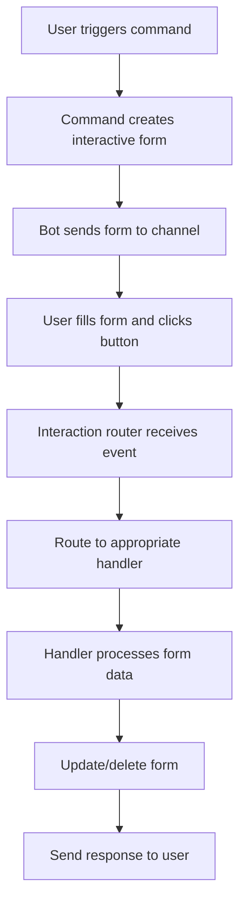

# 🎮 Interactive Features

Hướng dẫn chi tiết về các tính năng tương tác trong Bot Thời Gian Biểu.

## 📋 Tổng Quan

Bot sử dụng Mezon SDK để tạo các interactive elements:
- **Forms**: Thu thập input từ users
- **Buttons**: Actions và confirmations
- **Select menus**: Multiple choice options
- **Multi-step workflows**: Guided processes

## 🏗️ Kiến Trúc Interactive System

### 1. Core Components

```typescript
// Interactive Builder - Tạo forms
import { InteractiveBuilder } from 'mezon-sdk';

// Button Builder - Tạo buttons
import { ButtonBuilder, EButtonMessageStyle } from 'mezon-sdk';

// Interaction Registry - Đăng ký handlers
import { InteractionRegistry } from '../interactions/interaction-registry';

// Interaction Types
interface ButtonInteractionContext {
  action: string;
  clickerId: string;
  formData: Record<string, string>;
  send(message: string): Promise<void>;
  updateMessage(message: string): Promise<void>;
  deleteForm(): Promise<void>;
}
```

### 2. Interaction Flow



## 📝 Form Components

### 1. Input Fields

```typescript
// Text input
.addInputField(
  'field_name',           // Field ID
  'Field Label',          // Display label
  'Placeholder text',     // Placeholder
  { 
    type: 'text',         // Input type
    defaultValue: 'default',
    required: true 
  },
  'Help text'             // Help description
)

// Textarea
.addInputField(
  'description',
  'Mô tả chi tiết',
  'Nhập mô tả...',
  { textarea: true },
  'Tùy chọn'
)

// Number input
.addInputField(
  'minutes',
  'Số phút',
  '30',
  { 
    type: 'number',
    min: 1,
    max: 1440,
    defaultValue: '30'
  },
  'Từ 1 đến 1440 phút'
)

// Date input
.addInputField(
  'start_date',
  'Ngày bắt đầu',
  'Chọn ngày',
  { 
    type: 'date',
    defaultValue: '2026-04-28'
  },
  'Định dạng: YYYY-MM-DD'
)

// Time input
.addInputField(
  'start_time',
  'Giờ bắt đầu',
  'Chọn giờ',
  { 
    type: 'time',
    defaultValue: '14:00'
  },
  'Định dạng: HH:MM'
)
```

### 2. Select Fields

```typescript
// Single select
.addSelectField(
  'priority',
  'Mức ưu tiên',
  [
    { value: 'low', label: '🟢 Thấp' },
    { value: 'normal', label: '🟡 Vừa' },
    { value: 'high', label: '🔴 Cao' }
  ],
  'normal',               // Default value
  'Chọn mức ưu tiên'      // Help text
)

// Multi-select (nếu supported)
.addSelectField(
  'tags',
  'Tags',
  tagOptions,
  [],                     // Default empty array
  'Chọn nhiều tags',
  { multiple: true }
)
```

### 3. Complete Form Example

```typescript
// src/bot/commands/them-lich.command.ts
const embed = new InteractiveBuilder('📋 THÊM LỊCH MỚI')
  .setDescription('Điền thông tin bên dưới để tạo lịch mới')
  
  // Basic info
  .addInputField(
    'title',
    '📌 Tiêu đề *',
    'Vd: Họp team sprint review',
    {},
    'Bắt buộc'
  )
  .addInputField(
    'description',
    '📝 Mô tả',
    'Mô tả chi tiết (tuỳ chọn)',
    { textarea: true },
    'Tuỳ chọn'
  )
  
  // Type and priority
  .addSelectField(
    'item_type',
    '🏷️ Loại lịch',
    [
      { value: 'task', label: '📋 Task' },
      { value: 'meeting', label: '👥 Meeting' },
      { value: 'event', label: '🎉 Event' },
      { value: 'reminder', label: '⏰ Reminder' }
    ],
    'task',
    'Chọn loại lịch'
  )
  .addSelectField(
    'priority',
    '⚡ Ưu tiên',
    PRIORITY_OPTIONS,
    'normal',
    'Mức độ quan trọng'
  )
  
  // Date and time
  .addInputField(
    'start_date',
    '📅 Ngày bắt đầu *',
    'Chọn ngày',
    { 
      type: 'date',
      defaultValue: this.dateParser.toDateInputVietnam(defaultStart)
    },
    'Bắt buộc'
  )
  .addInputField(
    'start_time',
    '⏰ Giờ bắt đầu *',
    'Chọn giờ',
    { 
      type: 'time',
      defaultValue: this.dateParser.formatVietnamTime(defaultStart)
    },
    'Giờ Việt Nam'
  )
  
  // Recurrence
  .addSelectField(
    'recurrence_type',
    '🔁 Lặp lại',
    [
      { value: 'none', label: 'Không lặp' },
      { value: 'daily', label: 'Hàng ngày' },
      { value: 'weekly', label: 'Hàng tuần' },
      { value: 'monthly', label: 'Hàng tháng' }
    ],
    'none',
    'Tần suất lặp lại'
  )
  .addInputField(
    'recurrence_interval',
    '🔢 Khoảng lặp',
    '1',
    { 
      type: 'number',
      defaultValue: '1',
      min: 1,
      max: 365
    },
    'Mỗi N ngày/tuần/tháng'
  )
  
  .build();
```

## 🔘 Button Components

### 1. Button Styles

```typescript
import { EButtonMessageStyle } from 'mezon-sdk';

// Available styles
EButtonMessageStyle.PRIMARY    // Blue
EButtonMessageStyle.SECONDARY  // Gray  
EButtonMessageStyle.SUCCESS    // Green
EButtonMessageStyle.DANGER     // Red
EButtonMessageStyle.WARNING    // Yellow
```

### 2. Button Patterns

```typescript
// Confirmation buttons
const confirmButtons = new ButtonBuilder()
  .addButton(
    'interaction_id:confirm',
    '✅ Xác nhận',
    EButtonMessageStyle.SUCCESS
  )
  .addButton(
    'interaction_id:cancel',
    '❌ Hủy',
    EButtonMessageStyle.DANGER
  )
  .build();

// Action buttons with parameters
const actionButtons = new ButtonBuilder()
  .addButton(
    `schedule:complete:${scheduleId}`,
    '✅ Hoàn thành',
    EButtonMessageStyle.SUCCESS
  )
  .addButton(
    `schedule:edit:${scheduleId}`,
    '✏️ Sửa',
    EButtonMessageStyle.SECONDARY
  )
  .addButton(
    `schedule:delete:${scheduleId}`,
    '🗑️ Xóa',
    EButtonMessageStyle.DANGER
  )
  .build();

// Reminder snooze buttons
const reminderButtons = new ButtonBuilder()
  .addButton(
    `reminder:ack:${scheduleId}`,
    '✅ Đã nhận',
    EButtonMessageStyle.SUCCESS
  )
  .addButton(
    `reminder:snooze:${scheduleId}:10`,
    '⏰ 10p',
    EButtonMessageStyle.SECONDARY
  )
  .addButton(
    `reminder:snooze:${scheduleId}:60`,
    '⏰ 1h',
    EButtonMessageStyle.SECONDARY
  )
  .addButton(
    `reminder:snooze:${scheduleId}:240`,
    '⏰ 4h',
    EButtonMessageStyle.SECONDARY
  )
  .build();
```

### 3. Dynamic Button Generation

```typescript
// Generate buttons based on data
function createPaginationButtons(
  currentPage: number,
  totalPages: number,
  baseAction: string
): ButtonBuilder {
  const buttons = new ButtonBuilder();

  // Previous page
  if (currentPage > 1) {
    buttons.addButton(
      `${baseAction}:page:${currentPage - 1}`,
      '⬅️ Trước',
      EButtonMessageStyle.SECONDARY
    );
  }

  // Page info
  buttons.addButton(
    `${baseAction}:info`,
    `📄 ${currentPage}/${totalPages}`,
    EButtonMessageStyle.PRIMARY
  );

  // Next page
  if (currentPage < totalPages) {
    buttons.addButton(
      `${baseAction}:page:${currentPage + 1}`,
      'Sau ➡️',
      EButtonMessageStyle.SECONDARY
    );
  }

  return buttons;
}
```

## 🔄 Interaction Handlers

### 1. Handler Interface

```typescript
interface InteractionHandler {
  readonly interactionId: string;
  handleButton(ctx: ButtonInteractionContext): Promise<void>;
}

// Implementation
@Injectable()
export class ExampleInteractionHandler implements InteractionHandler {
  readonly interactionId = 'example';

  async handleButton(ctx: ButtonInteractionContext): Promise<void> {
    const [action, ...params] = ctx.action.split(':');

    switch (action) {
      case 'confirm':
        await this.handleConfirm(ctx);
        break;
      case 'cancel':
        await this.handleCancel(ctx);
        break;
      case 'edit':
        await this.handleEdit(ctx, params[0]);
        break;
      default:
        await ctx.send('❌ Hành động không hợp lệ');
    }
  }

  private async handleConfirm(ctx: ButtonInteractionContext): Promise<void> {
    const { formData, clickerId } = ctx;
    
    // Validate form data
    const validation = this.validateFormData(formData);
    if (validation.error) {
      await ctx.send(`❌ ${validation.error}`);
      return;
    }

    // Process data
    try {
      const result = await this.processFormData(formData, clickerId);
      
      // Close form and send success message
      await ctx.deleteForm();
      await ctx.send(`✅ Thành công: ${result.message}`);
    } catch (error) {
      await ctx.send(`❌ Lỗi: ${error.message}`);
    }
  }
}
```

### 2. Registration System

```typescript
// src/bot/interactions/interaction-registry.ts
@Injectable()
export class InteractionRegistry {
  private handlers = new Map<string, InteractionHandler>();

  register(handler: InteractionHandler): void {
    this.handlers.set(handler.interactionId, handler);
  }

  resolve(interactionId: string): InteractionHandler | undefined {
    return this.handlers.get(interactionId);
  }

  getAll(): InteractionHandler[] {
    return Array.from(this.handlers.values());
  }
}

// Auto-registration trong module
@Module({
  providers: [
    InteractionRegistry,
    ExampleInteractionHandler,
    // ... other handlers
  ],
})
export class InteractionsModule implements OnModuleInit {
  constructor(
    private readonly registry: InteractionRegistry,
    private readonly exampleHandler: ExampleInteractionHandler,
  ) {}

  onModuleInit(): void {
    this.registry.register(this.exampleHandler);
  }
}
```

### 3. Router Implementation

```typescript
// src/bot/interactions/interaction-router.ts
@Injectable()
export class InteractionRouter {
  constructor(private readonly registry: InteractionRegistry) {}

  async route(interactionData: any): Promise<void> {
    const { customId, user, message, formData } = interactionData;
    
    // Parse interaction ID from customId
    const [interactionId, action] = customId.split(':', 2);
    
    const handler = this.registry.resolve(interactionId);
    if (!handler) {
      console.warn(`No handler found for interaction: ${interactionId}`);
      return;
    }

    // Create context
    const ctx: ButtonInteractionContext = {
      action,
      clickerId: user.id,
      formData: formData || {},
      send: (msg) => this.sendMessage(message.channel_id, msg),
      updateMessage: (msg) => this.updateMessage(message.id, msg),
      deleteForm: () => this.deleteMessage(message.id),
    };

    try {
      await handler.handleButton(ctx);
    } catch (error) {
      console.error(`Interaction handler error:`, error);
      await ctx.send('❌ Đã xảy ra lỗi khi xử lý tương tác');
    }
  }
}
```

## 🎨 Advanced Interactive Patterns

### 1. Multi-Step Wizards

```typescript
// State management cho multi-step forms
interface WizardState {
  step: number;
  data: Record<string, any>;
  userId: string;
}

@Injectable()
export class WizardHandler implements InteractionHandler {
  readonly interactionId = 'wizard';
  private states = new Map<string, WizardState>();

  async handleButton(ctx: ButtonInteractionContext): Promise<void> {
    const [action, stepStr] = ctx.action.split(':');
    const step = parseInt(stepStr) || 1;

    switch (action) {
      case 'start':
        await this.startWizard(ctx);
        break;
      case 'next':
        await this.nextStep(ctx, step);
        break;
      case 'prev':
        await this.prevStep(ctx, step);
        break;
      case 'finish':
        await this.finishWizard(ctx);
        break;
    }
  }

  private async startWizard(ctx: ButtonInteractionContext): Promise<void> {
    const state: WizardState = {
      step: 1,
      data: {},
      userId: ctx.clickerId,
    };
    
    this.states.set(ctx.clickerId, state);
    await this.showStep(ctx, 1);
  }

  private async showStep(ctx: ButtonInteractionContext, step: number): Promise<void> {
    const embed = this.createStepForm(step);
    const buttons = this.createStepButtons(step);
    
    await ctx.updateMessage(''); // Clear previous content
    await this.botService.sendInteractive(ctx.channelId, embed, buttons);
  }

  private createStepForm(step: number): any {
    switch (step) {
      case 1:
        return new InteractiveBuilder('Bước 1: Thông tin cơ bản')
          .addInputField('title', 'Tiêu đề', 'Nhập tiêu đề...')
          .build();
      case 2:
        return new InteractiveBuilder('Bước 2: Thời gian')
          .addInputField('date', 'Ngày', '', { type: 'date' })
          .addInputField('time', 'Giờ', '', { type: 'time' })
          .build();
      case 3:
        return new InteractiveBuilder('Bước 3: Xác nhận')
          .setDescription('Xem lại thông tin và xác nhận')
          .build();
    }
  }
}
```

### 2. Conditional Forms

```typescript
// Forms thay đổi dựa trên user input
async createConditionalForm(userType: string): Promise<any> {
  const builder = new InteractiveBuilder('Cài đặt')
    .addInputField('name', 'Tên', 'Nhập tên...');

  // Conditional fields based on user type
  if (userType === 'admin') {
    builder.addSelectField(
      'permissions',
      'Quyền hạn',
      [
        { value: 'read', label: 'Chỉ đọc' },
        { value: 'write', label: 'Đọc/Ghi' },
        { value: 'admin', label: 'Quản trị' }
      ],
      'read'
    );
  }

  if (userType === 'premium') {
    builder.addInputField(
      'max_schedules',
      'Số lịch tối đa',
      '100',
      { type: 'number', min: 1, max: 1000 }
    );
  }

  return builder.build();
}
```

### 3. Real-time Form Updates

```typescript
// Update form content based on selections
async handleFormUpdate(ctx: ButtonInteractionContext): Promise<void> {
  const { formData } = ctx;
  
  // Get current selection
  const selectedType = formData.schedule_type;
  
  // Create updated form with conditional fields
  const updatedForm = await this.createUpdatedForm(selectedType, formData);
  
  // Update the form in place
  await ctx.updateForm(updatedForm);
}

private async createUpdatedForm(type: string, currentData: any): Promise<any> {
  const builder = new InteractiveBuilder('Cập nhật form')
    .addSelectField(
      'schedule_type',
      'Loại lịch',
      TYPE_OPTIONS,
      currentData.schedule_type || 'task'
    );

  // Add conditional fields
  if (type === 'meeting') {
    builder.addInputField(
      'attendees',
      'Người tham gia',
      currentData.attendees || '',
      { textarea: true }
    );
  } else if (type === 'task') {
    builder.addSelectField(
      'priority',
      'Ưu tiên',
      PRIORITY_OPTIONS,
      currentData.priority || 'normal'
    );
  }

  return builder.build();
}
```

## 🔧 Best Practices

### 1. Form Validation

```typescript
interface ValidationResult {
  isValid: boolean;
  errors: string[];
  warnings: string[];
}

class FormValidator {
  static validateScheduleForm(data: any): ValidationResult {
    const errors: string[] = [];
    const warnings: string[] = [];

    // Required fields
    if (!data.title?.trim()) {
      errors.push('Tiêu đề không được để trống');
    }

    if (!data.start_date || !data.start_time) {
      errors.push('Thời gian bắt đầu là bắt buộc');
    }

    // Date validation
    if (data.start_date && data.start_time) {
      const startDateTime = new Date(`${data.start_date} ${data.start_time}`);
      
      if (startDateTime <= new Date()) {
        errors.push('Thời gian bắt đầu phải ở tương lai');
      }
    }

    // End time validation
    if (data.end_date && data.end_time && data.start_date && data.start_time) {
      const startDateTime = new Date(`${data.start_date} ${data.start_time}`);
      const endDateTime = new Date(`${data.end_date} ${data.end_time}`);
      
      if (endDateTime <= startDateTime) {
        errors.push('Thời gian kết thúc phải sau thời gian bắt đầu');
      }
    }

    // Warnings
    if (data.title && data.title.length > 100) {
      warnings.push('Tiêu đề khá dài, có thể bị cắt khi hiển thị');
    }

    return {
      isValid: errors.length === 0,
      errors,
      warnings,
    };
  }
}
```

### 2. Error Handling

```typescript
async handleButton(ctx: ButtonInteractionContext): Promise<void> {
  try {
    // Main logic
    await this.processInteraction(ctx);
  } catch (error) {
    // Log error với context
    this.logger.error('Interaction error', {
      interactionId: this.interactionId,
      action: ctx.action,
      userId: ctx.clickerId,
      error: error.message,
      stack: error.stack,
    });

    // User-friendly error message
    const userMessage = this.getUserFriendlyError(error);
    await ctx.send(`❌ ${userMessage}`);

    // Cleanup if needed
    await this.cleanupOnError(ctx);
  }
}

private getUserFriendlyError(error: Error): string {
  // Map technical errors to user-friendly messages
  const errorMap: Record<string, string> = {
    'ValidationError': 'Dữ liệu nhập vào không hợp lệ',
    'DatabaseError': 'Lỗi hệ thống, vui lòng thử lại sau',
    'PermissionError': 'Bạn không có quyền thực hiện thao tác này',
    'NotFoundError': 'Không tìm thấy dữ liệu yêu cầu',
  };

  return errorMap[error.constructor.name] || 'Đã xảy ra lỗi không xác định';
}
```

### 3. Performance Optimization

```typescript
// Debounce form updates
class FormUpdateDebouncer {
  private timers = new Map<string, NodeJS.Timeout>();

  debounce(key: string, fn: () => Promise<void>, delay = 500): void {
    // Clear existing timer
    const existingTimer = this.timers.get(key);
    if (existingTimer) {
      clearTimeout(existingTimer);
    }

    // Set new timer
    const timer = setTimeout(async () => {
      await fn();
      this.timers.delete(key);
    }, delay);

    this.timers.set(key, timer);
  }
}

// Cache form templates
class FormTemplateCache {
  private cache = new Map<string, any>();

  getTemplate(key: string, generator: () => any): any {
    if (!this.cache.has(key)) {
      this.cache.set(key, generator());
    }
    return this.cache.get(key);
  }

  invalidate(key: string): void {
    this.cache.delete(key);
  }
}
```

### 4. Accessibility

```typescript
// Accessible form design
const accessibleForm = new InteractiveBuilder('Accessible Form')
  .setDescription('Form có thể truy cập được cho tất cả users')
  
  // Clear labels
  .addInputField(
    'email',
    'Địa chỉ email *',
    'example@domain.com',
    { type: 'email', required: true },
    'Nhập địa chỉ email hợp lệ. Bắt buộc.'
  )
  
  // Helpful descriptions
  .addInputField(
    'password',
    'Mật khẩu *',
    '',
    { type: 'password', required: true },
    'Ít nhất 8 ký tự, bao gồm chữ hoa, chữ thường và số'
  )
  
  // Clear button labels
  .build();

const accessibleButtons = new ButtonBuilder()
  .addButton(
    'form:submit',
    '✅ Gửi form (Enter)',
    EButtonMessageStyle.SUCCESS
  )
  .addButton(
    'form:cancel',
    '❌ Hủy bỏ (Escape)',
    EButtonMessageStyle.DANGER
  )
  .build();
```

---

**Interactive Features này tạo ra user experience mượt mà và intuitive, giúp users dễ dàng tương tác với bot qua các forms và buttons phong phú.**