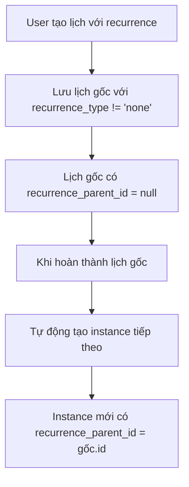

# 🔄 Recurring Events

Hướng dẫn chi tiết về hệ thống lịch lặp lại trong Bot Thời Gian Biểu.

## 📋 Tổng Quan

Hệ thống recurring events cho phép tạo lịch lặp lại theo chu kỳ:
- **Daily**: Hàng ngày
- **Weekly**: Hàng tuần  
- **Monthly**: Hàng tháng

Mỗi loại có thể tùy chỉnh interval (khoảng cách) và thời điểm dừng.

## 🏗️ Kiến Trúc Hệ Thống

### Database Schema

```sql
-- Các cột liên quan đến recurrence trong bảng schedules
recurrence_type VARCHAR(20) DEFAULT 'none',           -- none/daily/weekly/monthly
recurrence_interval INTEGER DEFAULT 1,               -- Khoảng cách (mỗi N ngày/tuần/tháng)
recurrence_until TIMESTAMP WITH TIME ZONE,           -- Dừng lặp sau thời điểm này
recurrence_parent_id INTEGER REFERENCES schedules(id) -- ID của lịch gốc trong series
```

### Entity Definition

```typescript
export type RecurrenceType = "none" | "daily" | "weekly" | "monthly";

@Entity("schedules")
export class Schedule {
  @Column({ type: "varchar", length: 20, default: "none" })
  recurrence_type!: RecurrenceType;

  @Column({ type: "integer", default: 1 })
  recurrence_interval!: number;

  @Column({ type: "timestamp with time zone", nullable: true })
  recurrence_until!: Date | null;

  @Column({ type: "integer", nullable: true })
  recurrence_parent_id!: number | null;
}
```

## 🔧 Cách Hoạt Động

### 1. Tạo Lịch Lặp



### 2. Logic Tạo Instance Tiếp Theo

```typescript
// src/schedules/schedules.service.ts
async completeSchedule(id: number, userId: string): Promise<void> {
  const schedule = await this.findByIdAndUser(id, userId);
  
  // Đánh dấu hoàn thành
  await this.repository.update(id, { 
    status: 'completed',
    updated_at: new Date()
  });

  // Tạo instance tiếp theo nếu có recurrence
  if (schedule.recurrence_type !== 'none') {
    await this.createNextRecurrenceInstance(schedule);
  }
}

private async createNextRecurrenceInstance(schedule: Schedule): Promise<void> {
  const nextStartTime = this.calculateNextOccurrence(
    schedule.start_time,
    schedule.recurrence_type,
    schedule.recurrence_interval
  );

  // Kiểm tra có vượt quá recurrence_until không
  if (schedule.recurrence_until && nextStartTime > schedule.recurrence_until) {
    return; // Dừng lặp
  }

  const nextEndTime = schedule.end_time 
    ? new Date(nextStartTime.getTime() + (schedule.end_time.getTime() - schedule.start_time.getTime()))
    : null;

  // Tạo instance mới
  await this.create({
    user_id: schedule.user_id,
    title: schedule.title,
    description: schedule.description,
    item_type: schedule.item_type,
    start_time: nextStartTime,
    end_time: nextEndTime,
    priority: schedule.priority,
    recurrence_type: schedule.recurrence_type,
    recurrence_interval: schedule.recurrence_interval,
    recurrence_until: schedule.recurrence_until,
    recurrence_parent_id: schedule.recurrence_parent_id || schedule.id, // Link về gốc
  });
}
```

### 3. Tính Toán Thời Gian Tiếp Theo

```typescript
// src/shared/utils/recurrence.ts
export function calculateNextOccurrence(
  currentDate: Date,
  type: RecurrenceType,
  interval: number
): Date {
  const next = new Date(currentDate);

  switch (type) {
    case 'daily':
      next.setDate(next.getDate() + interval);
      break;
      
    case 'weekly':
      next.setDate(next.getDate() + (interval * 7));
      break;
      
    case 'monthly':
      next.setMonth(next.getMonth() + interval);
      // Xử lý trường hợp ngày không tồn tại (vd: 31/2)
      if (next.getDate() !== currentDate.getDate()) {
        next.setDate(0); // Về ngày cuối tháng trước
      }
      break;
      
    default:
      throw new Error(`Unsupported recurrence type: ${type}`);
  }

  return next;
}
```

## 📝 Commands Liên Quan

### 1. Bật Lặp Lại (`*lich-lap`)

```typescript
// src/bot/commands/lich-lap.command.ts
async execute(ctx: CommandContext): Promise<void> {
  const [idStr, typeStr, intervalStr, ...flags] = ctx.args;
  
  // Parse arguments
  const id = parseInt(idStr);
  const type = parseRecurrenceType(typeStr); // daily/weekly/monthly
  const interval = intervalStr ? parseInt(intervalStr) : 1;
  
  // Parse --den flag
  let until: Date | null = null;
  const denIndex = flags.findIndex(f => f === '--den');
  if (denIndex >= 0 && flags[denIndex + 1]) {
    until = this.dateParser.parseVietnamLocal(`${flags[denIndex + 1]} 23:59`);
  }

  // Validate
  if (!id || !type || interval < 1) {
    await ctx.reply('❌ Cú pháp: `*lich-lap <ID> <daily|weekly|monthly> [interval] [--den DD/MM/YYYY]`');
    return;
  }

  // Update schedule
  await this.schedulesService.setRecurrence(id, ctx.message.sender_id, {
    type,
    interval,
    until
  });

  await ctx.reply(`✅ Đã bật lặp ${formatRecurrence(type, interval)} cho lịch #${id}`);
}
```

### 2. Tắt Lặp Lại (`*bo-lap`)

```typescript
// src/bot/commands/bo-lap.command.ts
async execute(ctx: CommandContext): Promise<void> {
  const [idStr] = ctx.args;
  const id = parseInt(idStr);

  if (!id) {
    await ctx.reply('❌ Cú pháp: `*bo-lap <ID>`');
    return;
  }

  await this.schedulesService.setRecurrence(id, ctx.message.sender_id, {
    type: 'none',
    interval: 1,
    until: null
  });

  await ctx.reply(`✅ Đã tắt lặp cho lịch #${id}`);
}
```

## 🎯 Use Cases & Examples

### 1. Daily Recurrence

**Ví dụ**: Standup meeting hàng ngày
```
*lich-lap 123 daily
```

**Kết quả**: Lịch lặp mỗi ngày cùng giờ

**Advanced**: Lặp 2 ngày 1 lần
```
*lich-lap 123 daily 2
```

### 2. Weekly Recurrence

**Ví dụ**: Họp team hàng tuần
```
*lich-lap 124 weekly
```

**Kết quả**: Lặp mỗi tuần cùng thứ và giờ

**Advanced**: Lặp 2 tuần 1 lần đến cuối năm
```
*lich-lap 124 weekly 2 --den 31/12/2026
```

### 3. Monthly Recurrence

**Ví dụ**: Review tháng
```
*lich-lap 125 monthly
```

**Kết quả**: Lặp mỗi tháng cùng ngày và giờ

**Edge case**: Ngày 31 tháng 1 → 28/29 tháng 2 (tự động adjust)

## 🔍 Queries & Reports

### 1. Lấy Tất Cả Lịch Trong Series

```typescript
async getRecurrenceSeries(parentId: number, userId: string): Promise<Schedule[]> {
  return this.repository.find({
    where: [
      { id: parentId, user_id: userId },
      { recurrence_parent_id: parentId, user_id: userId }
    ],
    order: { start_time: 'ASC' }
  });
}
```

### 2. Thống Kê Recurring Events

```typescript
async getRecurrenceStats(userId: string): Promise<RecurrenceStats> {
  const result = await this.repository
    .createQueryBuilder('schedule')
    .select('recurrence_type', 'type')
    .addSelect('COUNT(*)', 'count')
    .where('user_id = :userId', { userId })
    .andWhere('recurrence_type != :none', { none: 'none' })
    .groupBy('recurrence_type')
    .getRawMany();

  return {
    daily: result.find(r => r.type === 'daily')?.count || 0,
    weekly: result.find(r => r.type === 'weekly')?.count || 0,
    monthly: result.find(r => r.type === 'monthly')?.count || 0,
  };
}
```

### 3. Tìm Lịch Sắp Hết Hạn Lặp

```typescript
async getExpiringRecurrences(days: number = 7): Promise<Schedule[]> {
  const cutoff = new Date();
  cutoff.setDate(cutoff.getDate() + days);

  return this.repository.find({
    where: {
      recurrence_type: Not('none'),
      recurrence_until: LessThan(cutoff),
      status: 'pending'
    },
    order: { recurrence_until: 'ASC' }
  });
}
```

## 🛠️ Advanced Features

### 1. Bulk Operations

#### Xóa Toàn Bộ Series
```typescript
async deleteRecurrenceSeries(parentId: number, userId: string): Promise<number> {
  const result = await this.repository.delete({
    recurrence_parent_id: parentId,
    user_id: userId
  });
  
  await this.repository.delete({
    id: parentId,
    user_id: userId
  });

  return (result.affected || 0) + 1;
}
```

#### Update Toàn Bộ Series
```typescript
async updateRecurrenceSeries(
  parentId: number, 
  userId: string, 
  updates: Partial<Schedule>
): Promise<void> {
  // Update parent
  await this.repository.update(
    { id: parentId, user_id: userId },
    updates
  );

  // Update all instances
  await this.repository.update(
    { recurrence_parent_id: parentId, user_id: userId },
    updates
  );
}
```

### 2. Smart Scheduling

#### Tránh Ngày Lễ
```typescript
function adjustForHolidays(date: Date, holidays: Date[]): Date {
  const adjusted = new Date(date);
  
  while (holidays.some(h => isSameDay(adjusted, h))) {
    adjusted.setDate(adjusted.getDate() + 1);
  }
  
  return adjusted;
}
```

#### Respect Working Hours
```typescript
function adjustForWorkingHours(
  date: Date, 
  workingHours: { start: string; end: string }
): Date {
  const adjusted = new Date(date);
  const [startHour, startMin] = workingHours.start.split(':').map(Number);
  
  // Nếu ngoài giờ làm việc, đẩy về sáng hôm sau
  if (adjusted.getHours() < startHour || adjusted.getHours() >= 18) {
    adjusted.setDate(adjusted.getDate() + 1);
    adjusted.setHours(startHour, startMin, 0, 0);
  }
  
  return adjusted;
}
```

### 3. Recurrence Templates

```typescript
interface RecurrenceTemplate {
  name: string;
  type: RecurrenceType;
  interval: number;
  description: string;
}

const RECURRENCE_TEMPLATES: RecurrenceTemplate[] = [
  {
    name: 'daily-standup',
    type: 'daily',
    interval: 1,
    description: 'Daily standup meeting (weekdays only)'
  },
  {
    name: 'weekly-review',
    type: 'weekly',
    interval: 1,
    description: 'Weekly team review'
  },
  {
    name: 'monthly-planning',
    type: 'monthly',
    interval: 1,
    description: 'Monthly planning session'
  }
];
```

## 🐛 Edge Cases & Handling

### 1. Daylight Saving Time

```typescript
function handleDSTTransition(date: Date, timezone: string): Date {
  // Sử dụng thư viện như date-fns-tz để handle DST
  return zonedTimeToUtc(date, timezone);
}
```

### 2. Month End Dates

```typescript
function handleMonthEndRecurrence(baseDate: Date, targetMonth: number): Date {
  const result = new Date(baseDate);
  result.setMonth(targetMonth);
  
  // Nếu ngày không tồn tại (vd: 31/2), về ngày cuối tháng
  if (result.getMonth() !== targetMonth) {
    result.setDate(0); // Về ngày cuối tháng trước
  }
  
  return result;
}
```

### 3. Leap Year Handling

```typescript
function handleLeapYear(date: Date): Date {
  // 29/2 trong năm nhuận → 28/2 trong năm thường
  if (date.getMonth() === 1 && date.getDate() === 29) {
    const nextYear = date.getFullYear() + 1;
    if (!isLeapYear(nextYear)) {
      const adjusted = new Date(date);
      adjusted.setFullYear(nextYear);
      adjusted.setDate(28);
      return adjusted;
    }
  }
  
  return date;
}
```

## 📊 Performance Considerations

### 1. Batch Processing

```typescript
// Tạo nhiều instances cùng lúc thay vì từng cái một
async createRecurrenceInstances(
  schedule: Schedule, 
  count: number
): Promise<Schedule[]> {
  const instances: Partial<Schedule>[] = [];
  let currentDate = schedule.start_time;

  for (let i = 0; i < count; i++) {
    currentDate = calculateNextOccurrence(
      currentDate,
      schedule.recurrence_type,
      schedule.recurrence_interval
    );

    if (schedule.recurrence_until && currentDate > schedule.recurrence_until) {
      break;
    }

    instances.push({
      // ... schedule data với currentDate
    });
  }

  return this.repository.save(instances);
}
```

### 2. Lazy Loading

```typescript
// Chỉ tạo instance tiếp theo khi cần, không tạo trước hết
async getOrCreateNextInstance(parentId: number): Promise<Schedule> {
  // Tìm instance tiếp theo
  let nextInstance = await this.findNextPendingInstance(parentId);
  
  if (!nextInstance) {
    // Tạo mới nếu chưa có
    const parent = await this.findById(parentId);
    nextInstance = await this.createNextRecurrenceInstance(parent);
  }
  
  return nextInstance;
}
```

## 🔧 Troubleshooting

### Common Issues

1. **Timezone confusion**: Luôn store UTC, convert khi display
2. **Month overflow**: Handle ngày không tồn tại (31/2)
3. **Performance**: Không tạo quá nhiều instances advance
4. **Memory leaks**: Cleanup expired recurrences

### Debug Commands

```typescript
// Debug recurrence calculation
*debug-recurrence 123
// Shows next 5 occurrences for schedule #123

// Cleanup orphaned instances
*cleanup-recurrence
// Removes instances without valid parent
```

---

**Hệ thống recurring events này cung cấp flexibility cao while maintaining data consistency và performance tốt.**